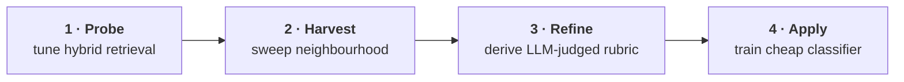
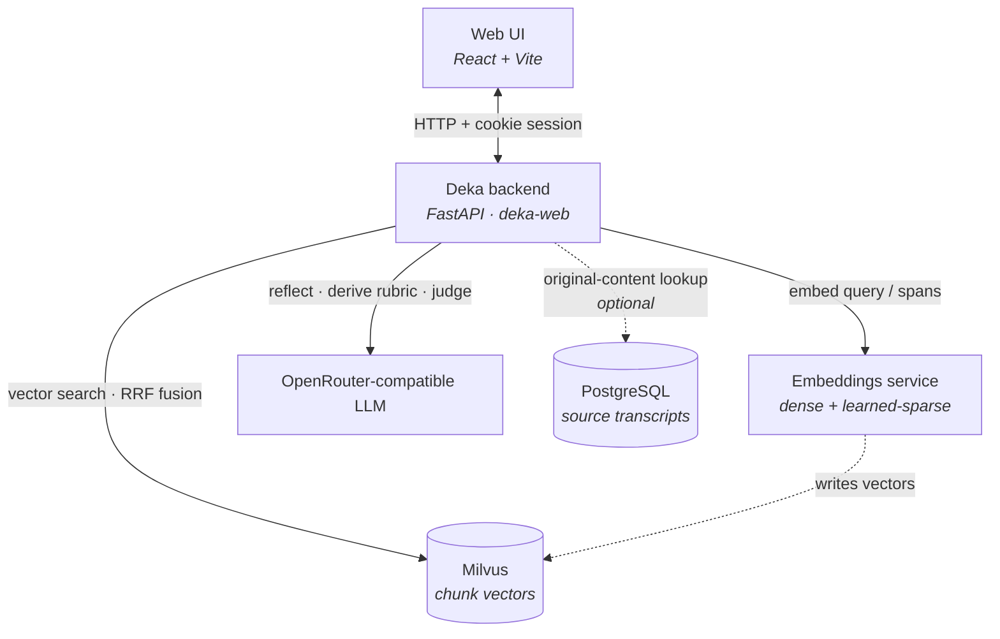

**English** · [简体中文](README.zh-CN.md)

Deka — **Definition and Embedding Knowledge Alignment** —
is a human-in-the-loop workbench that escalates a domain expert’s intuitive notion of a query
into a precise, reproducible, and scalable set of labelled results. You start with a fuzzy notion — *"find me
content like this"* — and end with a precise, reproducible, and scalable set
of labelled results drawn from a vector-search corpus. 

It proceeds in four phases:



| Phase | What happens |
| --- | --- |
| **1.&nbsp;Probe** | Interactively tune hybrid (dense + learned-sparse) retrieval until the operator's relevance judgements converge. |
| **2.&nbsp;Harvest** | Treat the validated FIT examples as a query and sweep the corpus for their embedding neighbourhood. |
| **3.&nbsp;Refine** | Distil that geometric cohort into an explicit, auditable language rubric, then judge a stratified sample with an LLM. |
| **4.&nbsp;Apply** | Train a low-cost classifier on the rubric-judged sample to label the full cohort at near-zero marginal cost. |

## Learning the core idea

**The ideas matter more than the code.** This repository ships a working web app,
but treat it as a *demonstration* — one concrete embodiment of the method, not the
point of it. The real contribution is the **harness**: the way a general-purpose
model and a busy domain expert are arranged into a dependable retrieval-tuning
instrument. That pattern generalises far beyond this particular corpus, this UI,
or even this problem. If you read one thing here, read the whitepaper.

The design rationale — the harness philosophy, the four-phase method, and the
geometry behind the harvest — lives in
[`whitepaper/whitepaper.md`](whitepaper/whitepaper.md). Read it there directly,
or build the typeset PDF (with rendered figures and a table of contents):

- **[Pandoc](https://pandoc.org/)** — Markdown → LaTeX
- **[Tectonic](https://tectonic-typesetting.github.io/)** — LaTeX → PDF (self-contained, fetches its own packages)

```bash
cd whitepaper && ./build.sh        # → whitepaper/whitepaper.pdf
```

`build.sh` runs `pandoc whitepaper.md --pdf-engine=tectonic --toc`, pulling
typesetting options from `metadata.yaml` and the diagrams from `figures/`.

## Why I Built Deka

Deka grew out of a corpus of customer-conversation transcripts that encode an
organisation's operational knowledge — how reps handle objections, build rapport,
steer renewals — yet sit almost entirely inaccessible: far too large to read, and
in Chinese.

Unlocking it means asking a question and reliably getting back the chunks that
answer it. The hard part: only a domain expert can judge whether a chunk
*genuinely* fits — but that expert shouldn't need to understand cosine metrics or
rank fusion to do so. Deka is the harness that resolves the asymmetry — the
machine owns the retrieval mechanics, the human owns the judgement — turning a
handful of expert verdicts into a label on every relevant chunk in the corpus.

## Setup

### Prerequisites

Build tools:

- **[uv](https://docs.astral.sh/uv/) + Python 3.11+** — backend
- **Node.js 18+** — web UI

Live retrieval also needs these services:

- **Milvus** — vector store for chunk embeddings
- **Embeddings service** — produces dense + learned-sparse vectors
- **OpenRouter-compatible LLM** — reflection, rubric, judging
- **PostgreSQL** *(optional)* — original-content lookup

How they wire together:



### 1. Install dependencies

```bash
uv sync
```

### 2. Configure

Copy each template to its real name, then edit:

```bash
cp .env.example          .env
cp config.yaml.example   config.yaml
cp scopes.yaml.example   scopes.yaml
cp users.yaml.example    users.yaml
```

| File | What to set |
| --- | --- |
| `.env` | `OPENROUTER_API_KEY` |
| `config.yaml` | `search.embed_url`, `milvus_uri`, `postgres.dsn` → your services |
| `scopes.yaml` | each scope → its Milvus collection + Postgres table |
| `users.yaml` | a web user (next step) |

### 3. Create a login token

The web UI gates every request on a signed-cookie session keyed to `users.yaml`.
Generate a token and store **only its SHA-256**:

```bash
python -c "import secrets,hashlib; t=secrets.token_hex(32); print('token: ',t); print('sha256:',hashlib.sha256(t.encode()).hexdigest())"
```

- Put the `sha256` under a user `id` in `users.yaml`; keep the `token` to log in.
- *(Optional)* persist sessions across backend restarts:
  ```bash
  export DEKA_SESSION_SECRET=$(python -c "import secrets;print(secrets.token_urlsafe(32))")
  ```

## Run the web app

Start the backend and the frontend in two terminals:

```bash
# Terminal 1 — FastAPI backend (http://127.0.0.1:8787)
uv run deka-web

# Terminal 2 — Vite dev server (http://localhost:5173)
cd web && npm install && npm run dev
```

Open <http://localhost:5173> and sign in with the token from step 3.

### Single-server alternative

Build the UI, then let the backend serve it directly at <http://127.0.0.1:8787>:

```bash
cd web && npm install && npm run build
uv run deka-web
```

## Development

```bash
uv run pytest        # run the test suite
uv run ruff check .  # lint
```

## File structure

```
.
├── src/                     # Python backend
│   ├── search/              # Phase 1 — hybrid search + RRF fusion
│   ├── reflection/          # Phase 1 — LLM reflection agent
│   ├── extraction/          # span extraction (cached)
│   ├── anchor/              # Phase 2 — FIT-anchored harvest
│   ├── refine/              # Phase 3 — rubric derivation + LLM judging
│   ├── apply/               # Phase 4 — logistic-regression classifier
│   ├── session/             # session state machine
│   ├── scopes/              # corpus scope registry
│   ├── postgres/            # original-content fetcher
│   ├── replay/              # convergence metrics
│   ├── logging/             # progress-log writer
│   ├── auth/                # cookie-session auth
│   └── web_api/             # FastAPI backend (the `deka-web` entry point)
├── web/                     # React + Vite frontend (screens, components, state)
├── harness/prompts/         # runtime LLM prompts (system, reflection, extraction, rubric)
├── whitepaper/              # design paper + figures
├── tests/                   # pytest suite
├── config.yaml.example      # service endpoints + per-phase tuning
├── scopes.yaml.example      # scope → {Milvus collection, Postgres table}
├── users.yaml.example       # web auth — users + token SHA-256s
├── .env.example             # API keys + endpoint overrides
└── pyproject.toml           # Python project (managed with uv)
```

The `*.example` files are templates; copy each to its real name (gitignored) to
override it. Loaders fall back to the example when the real file is absent.
