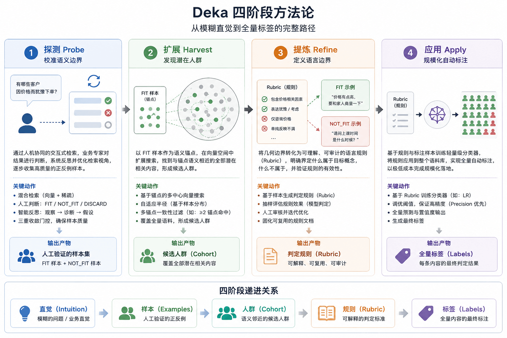
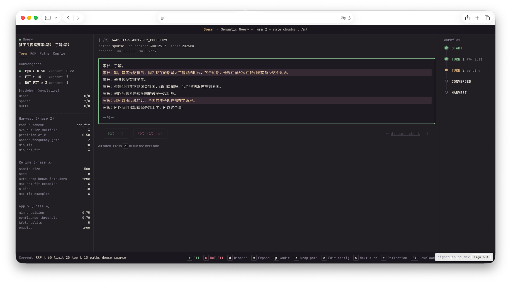
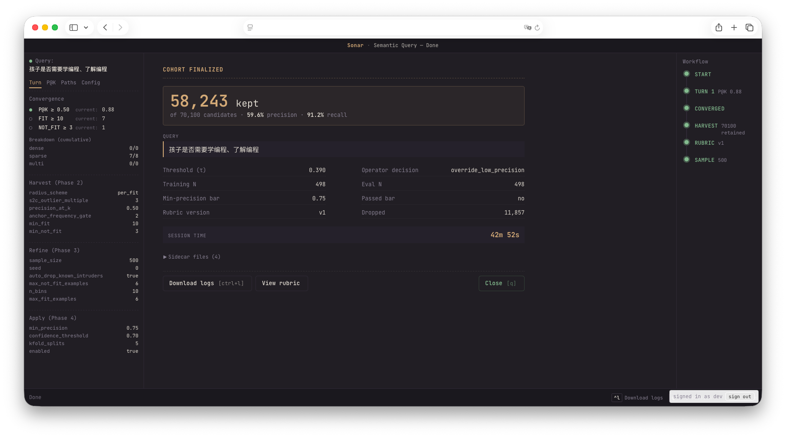
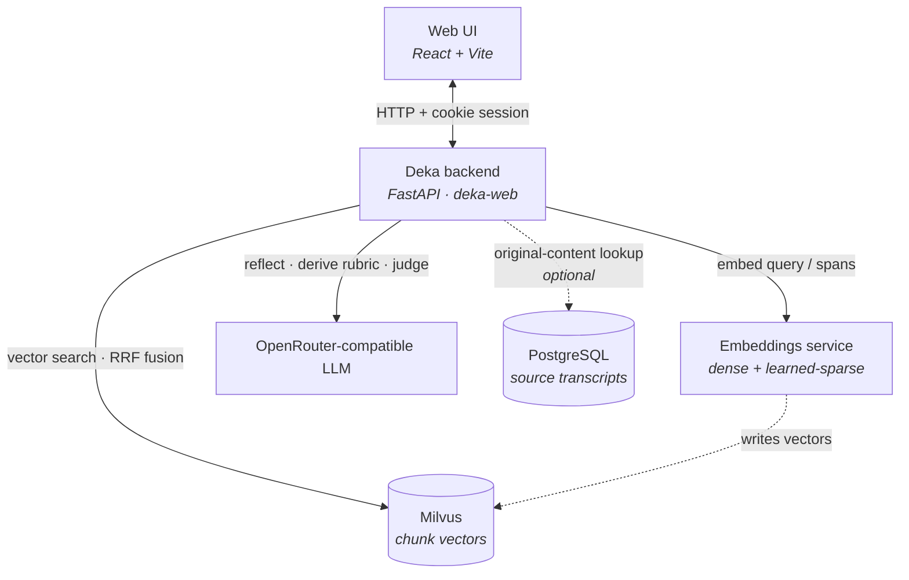

[](https://github.com/tmasjc/deka-oss/actions/workflows/ci.yml)
[](https://www.python.org/downloads/)
[](https://github.com/astral-sh/ruff)

Deka —— **Definition and Embedding Knowledge Alignment（定义与嵌入知识对齐）**——
是一种面向语义检索的定义与嵌入知识对齐方法，可以理解为一套脚手架。你从一个模糊的念头出发——「帮我找出类似这样的内容」——它一步步把这份直觉打磨成一组精确、可复现、可大规模套用的标注结果。



## 工作台一览

一次真实会话中的两个瞬间——操作者调优检索，以及最终成形的簇。

<table>
  <tr>
    <td width="50%"></td>
    <td width="50%"></td>
  </tr>
  <tr>
    <td><sub><b>Probe（探测）</b>——交互式调优混合检索。操作者逐条判定每个候选文本块中的高亮片段，侧栏实时跟踪收敛指标（PQK、FIT、NOT_FIT）与各阶段设置。</sub></td>
    <td><sub><b>Done（完成）</b>——最终成形的簇：在 70,100 个候选中保留 58,243 个，精确率 59.6% / 召回率 91.2%，并附上产生该结果的 rubric、阈值与操作者决策。右侧的工作流轨道记录了从 START 到 SAMPLE 的每一步。</sub></td>
  </tr>
</table>

## 理解核心思想

**思想比代码更重要。** 本仓库附带了一个可运行的 Web 应用，但请把它看作是方法的一种落地示例，而非方法本身。真正有价值的是这套**脚手架（harness）**：利用语言大模型和领域专家的直觉，组织成一件可靠的检索调优工具。这套范式的适用面远不止这份语料库、这个界面。

完整的设计思路——脚手架的理念、四阶段方法，以及扩展背后的几何原理——都在
[`whitepaper/whitepaper.md`](whitepaper/whitepaper.md) 里。你可以直接读它，也可以自己构建排版后的
PDF（含渲染好的插图与目录）：

- **[Pandoc](https://pandoc.org/)** —— Markdown → LaTeX
- **[Tectonic](https://tectonic-typesetting.github.io/)** —— LaTeX → PDF（自包含，会自行拉取所需宏包）

```bash
cd whitepaper && ./build.sh        # → whitepaper/whitepaper.pdf
```

`build.sh` 会执行 `pandoc whitepaper.md --pdf-engine=tectonic --toc`，从 `metadata.yaml`
读取排版选项，并引入 `figures/` 下的各幅插图。

## 为什么做 Deka

Deka 最初诞生于一个看似简单却长期存在的问题：**企业积累了海量一线语料，却难以真正利用这些知识**。

客户对话记录中沉淀着组织最真实的运营经验——销售如何回应价格异议、如何建立信任、如何推动转化，以及客户在决策过程中反复出现的顾虑与需求。然而，这些知识往往散落在数百万字的文本之中，既无法被系统阅读，也难以被有效复用。

从表面上看，Deka 是一套围绕语义检索、标签挖掘与用户画像构建的方法论；但更本质地，它试图回答一个长期被忽视的问题：

**如何将业务专家脑海中模糊而隐性的认知，转化为可验证、可复用、可规模化执行的知识资产**。

## 安装配置

### 前置条件

构建工具：

- **[uv](https://docs.astral.sh/uv/) + Python 3.11+** —— 后端
- **Node.js 18+** —— Web 界面

若要做实时检索，还需要以下服务：

- **Milvus** —— 存储文本块嵌入的向量库
- **嵌入服务（Embeddings service）** —— 产出稠密 + 学习型稀疏向量
- **兼容 OpenRouter 的 LLM** —— 用于反思、rubric 推导、判定
- **PostgreSQL** *（可选）* —— 原文查询

它们之间如何协作：



### 1. 安装依赖

```bash
uv sync
```

### 2. 配置

把每个模板复制成正式文件名，然后编辑：

```bash
cp .env.example          .env
cp config.yaml.example   config.yaml
cp scopes.yaml.example   scopes.yaml
cp users.yaml.example    users.yaml
```

| 文件 | 需要设置什么 |
| --- | --- |
| `.env` | `OPENROUTER_API_KEY` |
| `config.yaml` | `search.embed_url`、`milvus_uri`、`postgres.dsn` → 指向你的服务 |
| `scopes.yaml` | 每个 scope → 对应的 Milvus collection + Postgres table |
| `users.yaml` | 一个 Web 用户（见下一步） |

### 3. 生成登录令牌

Web 界面会对每个请求做鉴权，依据是一个签名 cookie 会话，而会话信息以 `users.yaml` 为准。
生成一个令牌，并**只**保存它的 SHA-256：

```bash
python -c "import secrets,hashlib; t=secrets.token_hex(32); print('token: ',t); print('sha256:',hashlib.sha256(t.encode()).hexdigest())"
```

- 把 `sha256` 填到 `users.yaml` 中某个用户 `id` 之下；`token` 自己留着用于登录。
- *（可选）* 让会话在后端重启后依然有效：
  ```bash
  export DEKA_SESSION_SECRET=$(python -c "import secrets;print(secrets.token_urlsafe(32))")
  ```

## 运行 Web 应用

在两个终端中分别启动后端和前端：

```bash
# 终端 1 —— FastAPI 后端 (http://127.0.0.1:8787)
uv run deka-web

# 终端 2 —— Vite 开发服务器 (http://localhost:5173)
cd web && npm install && npm run dev
```

打开 <http://localhost:5173>，用第 3 步的令牌登录。

### 单服务器方式

先把前端构建出来，再由后端直接在 <http://127.0.0.1:8787> 上托管它：

```bash
cd web && npm install && npm run build
uv run deka-web
```

## 开发

```bash
uv run pytest        # 运行测试套件
uv run ruff check .  # 代码检查
```

## 目录结构

```
.
├── src/                     # Python 后端
│   ├── search/              # 阶段 1 —— 混合检索 + RRF 融合
│   ├── reflection/          # 阶段 1 —— LLM 反思代理
│   ├── extraction/          # span 抽取（带缓存）
│   ├── anchor/              # 阶段 2 —— 以 FIT 为锚点的扩展
│   ├── refine/              # 阶段 3 —— rubric 推导 + LLM 判定
│   ├── apply/               # 阶段 4 —— 逻辑回归分类器
│   ├── session/             # 会话状态机
│   ├── scopes/              # 语料库 scope 注册表
│   ├── postgres/            # 原文获取器
│   ├── replay/              # 收敛度量
│   ├── logging/             # 进度日志写入器
│   ├── auth/                # cookie 会话鉴权
│   └── web_api/             # FastAPI 后端（`deka-web` 入口）
├── web/                     # React + Vite 前端（页面、组件、状态）
├── harness/prompts/         # 运行时 LLM 提示词（系统、反思、抽取、rubric）
├── whitepaper/              # 设计白皮书 + 图
├── tests/                   # pytest 测试套件
├── config.yaml.example      # 服务端点 + 各阶段调优
├── scopes.yaml.example      # scope → {Milvus collection, Postgres table}
├── users.yaml.example       # Web 鉴权 —— 用户 + 令牌 SHA-256
├── .env.example             # API key + 端点覆盖
└── pyproject.toml           # Python 项目（用 uv 管理）
```

`*.example` 文件都是模板；把它们各自复制成正式文件名（正式文件已被 gitignore）即可覆盖默认值。
正式文件不存在时，加载器会自动回退到对应的 example。
